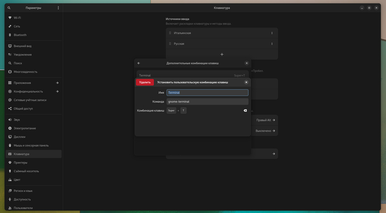

# Включаем дробное масштабирование

<figure><figcaption></figcaption></figure>

```bash
gsettings set org.gnome.mutter experimental-features “[‘scale-monitor-framebuffer’]”
```


Но включение дробного масштабирования, может привести к "мыльной" картинке, поэтому лично я увeличиваю "коэффициент масштабирования" самого текста в Gnome Tweaks.


<figure><figcaption></figcaption></figure>
